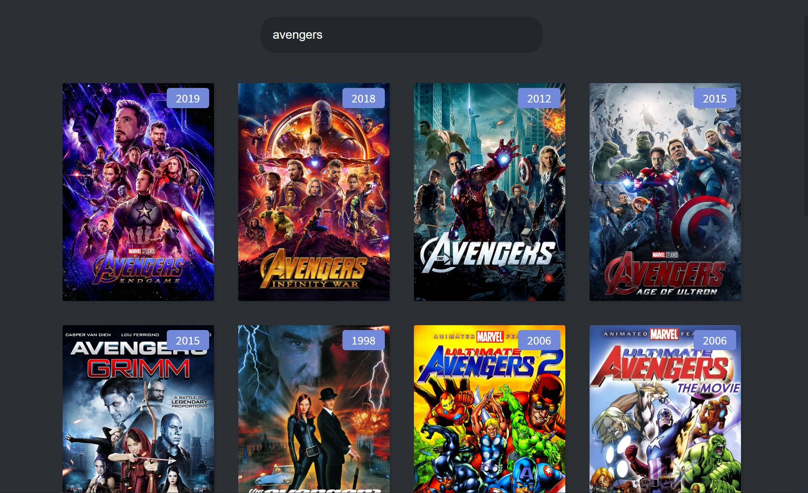
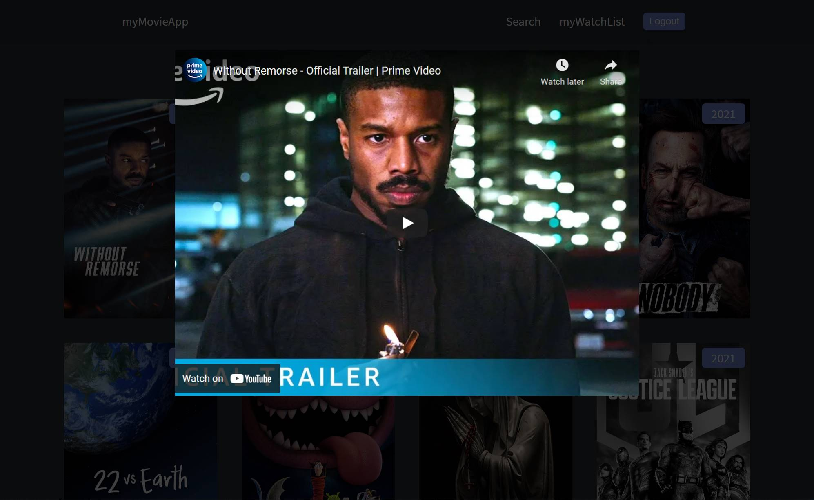
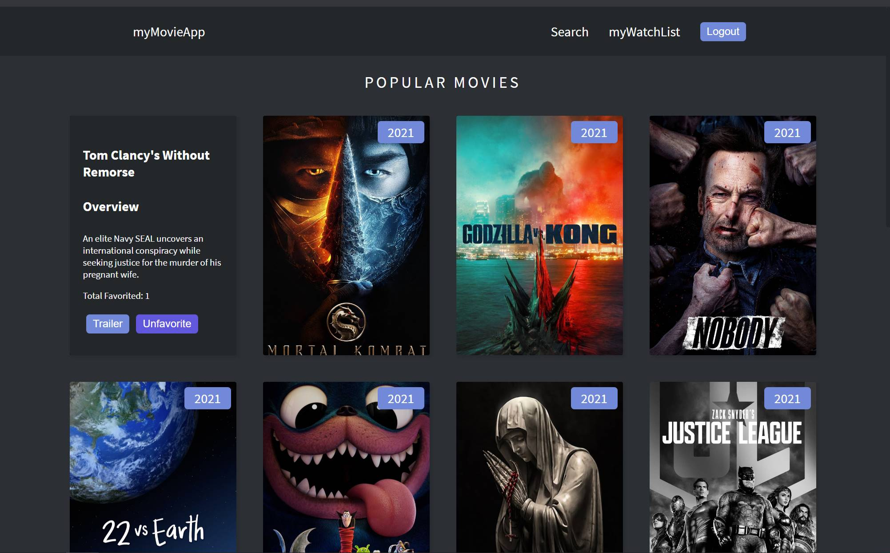
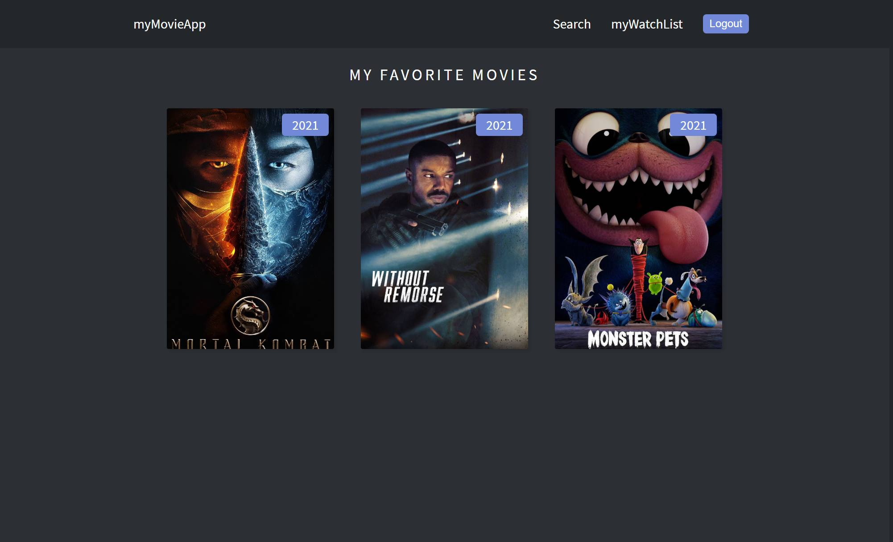

Created a full stack movie watchlist application using MERN. 

[Link to website](https://objective-bohr-5d19ac.netlify.app/)

<!--  -->

App has functionality for users to search movies, and browse movie trailers

Users can manage a list of their favorite movies

